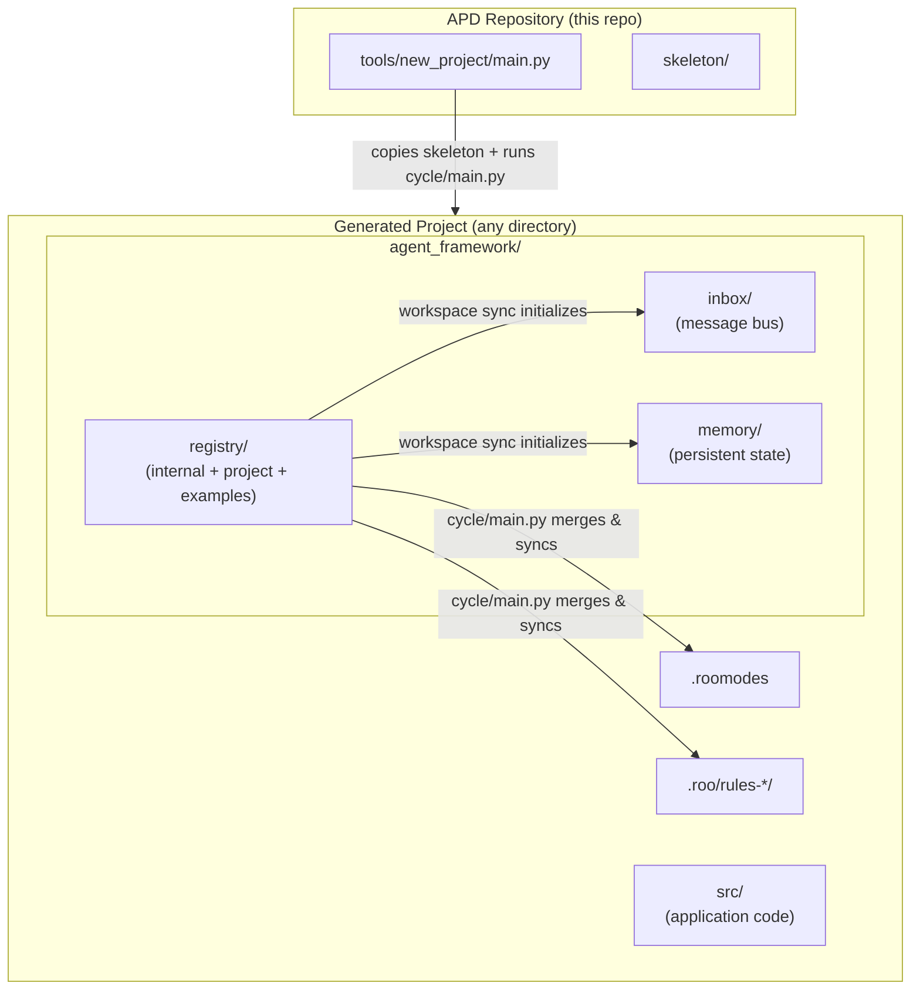
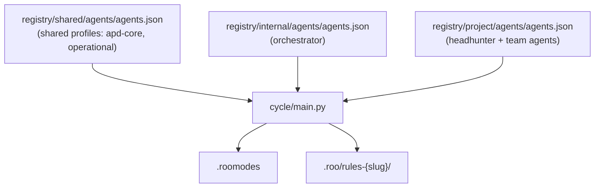

# APD Architecture

## What is APD?

**APD (Autonomous Project Development)** is a multi-agent AI orchestration framework that automates software development cycles. It uses [Roo](https://github.com/RooVetGit/Roo-Code) (a VS Code extension) as the agent runtime and the **filesystem as an asynchronous communication bus**, enabling a team of specialized AI agents to collaborate on a project without human intervention.

The core problem APD solves: AI coding assistants are powerful but require constant human direction. APD removes that bottleneck by defining a structured pipeline where agents hand off work to each other autonomously, only surfacing to the human when a decision or review is genuinely needed.

---

## High-Level Architecture



---

## Two Layers

### Layer 1 — Initializer (`tools/new_project/main.py`)

The [`tools/new_project/main.py`](../tools/new_project/main.py) tool is the **entry point** for creating a new APD-managed project. It:

1. Asks for a destination folder and project name (or a Git repository URL for remote projects).
2. Copies the entire [`skeleton/`](../skeleton/) directory into the new project root.
3. Generates `agent_framework/config.json` with project metadata.
4. Calls [`sync_registry.run()`](../skeleton/agent_framework/registry/internal/workspace/tools/internal/cycle/sync_registry.py) directly to bootstrap the initial runtime environment (`.roomodes`, `.roo/rules-*/`, workspace files).

After this step, the generated project is fully self-contained and ready to be opened in VS Code with Roo.

### Layer 2 — Skeleton (`skeleton/`)

The [`skeleton/`](../skeleton/) directory is the **template** for every APD project. It contains:

| Path | Purpose |
|---|---|
| `agent_framework/registry/shared/` | Shared profiles (global + XML + operational rules) and initial inbox/memory files synced into every project |
| `agent_framework/registry/internal/` | Orchestrator blueprint and the `cycle/main.py` tool |
| `agent_framework/registry/project/` | Headhunter blueprint and project workspace defaults |
| `agent_framework/registry/examples/` | Example teams the Headhunter can reference when designing a new team |
| `agent_framework/inbox/` | Filesystem message bus (created/reset by workspace sync) |
| `agent_framework/memory/` | Persistent technical state shared across agents |
| `agent_framework/templates/` | User-facing document templates (e.g., project briefing template) |
| `src/` | Application source code |

---

## Runtime Environment

`cycle/main.py` generates and maintains the following runtime artifacts in the project root:

### `.roomodes`
A JSON file consumed by the Roo VS Code extension. It defines all **custom agent modes** for the project — one entry per agent in the merged roster. Each mode entry contains the agent's slug, name, role definition, and groups.

### `.roo/rules-{slug}/`
Per-agent rule directories. Each directory contains the **flattened Markdown rule files** that Roo injects as system context for that agent. `cycle/main.py` builds these by resolving each agent's profile list and copying the referenced files.

### `agent_framework/inbox/`
The **asynchronous message bus**. A single global inbox. Agents write outgoing messages to `draft/`, and `post_work` validates and promotes them through the pipeline.

```
agent_framework/inbox/
├── draft/     ← agent writes the next message here (message.md + any attachments)
├── unread/    ← current message being processed (promoted from draft/ by post_work)
└── read/      ← archive of all processed messages (timestamped subfolders)
```

Each entry in `read/` is a folder named `{YYYYMMDD_HHMMSS}_{from}_{to}/` containing the archived `message.md` and any attachments.

### `agent_framework/memory/`
Persistent files shared across all agents:

| File | Purpose |
|---|---|
| `decisions.md` | Log of significant architectural and design decisions |
| `lessons_learned.md` | Log of recurring errors (technical and behavioral) and their solutions, shared across all agents to prevent repeated mistakes |

---

## Filesystem as Async Communication Bus

APD uses the filesystem — not API calls, shared memory, or message queues — as its inter-agent communication layer. This design choice provides:

- **Persistence**: messages survive process restarts and VS Code reloads.
- **Auditability**: the full message history is preserved in `read/` folders.
- **Simplicity**: no external infrastructure required; any file system works.
- **Decoupling**: agents never call each other directly; the Orchestrator mediates all routing.

The flow is:
1. An agent concludes its task by calling `attempt_completion` with the outgoing XML message as the result. The metadata block must include `from`, `to`, and `subject`.
2. The Orchestrator receives the result and writes it verbatim to `agent_framework/inbox/draft/message.md`.
3. The Orchestrator runs `cycle/main.py`, which archives the current `unread/` contents into a timestamped folder inside `read/`, promotes `draft/` contents to `unread/`, and returns the recipient's slug.
4. The Orchestrator invokes the recipient agent via Roo's `new_task` tool, passing the XML message as instructions.

---

## Profiles-Based Rules System

Agent behavior is defined by named **profiles** declared in each `agents.json` file. `cycle/main.py` resolves each agent's profile list and flattens all referenced Markdown files into the agent's `.roo/rules-{slug}/` directory.

There are three `agents.json` sources that are merged on every cycle:

| Source | Path | Contents |
|---|---|---|
| **Shared** | `registry/shared/agents/agents.json` | Shared profiles only — no agents. Defines `apd-core` (global + XML rules) and `operational` (operational + tools rules) profiles available to all agents across all sources. |
| **Internal** | `registry/internal/agents/agents.json` | Fixed agents (Orchestrator). References shared profiles via `{ "name": "...", "source": "shared" }`. |
| **Project** | `registry/project/agents/agents.json` | Project agents (Headhunter + operational team). References shared profiles and defines team-specific profiles. |

The Headhunter writes the project `agents.json` at runtime when provisioning a new team. `cycle/main.py` detects the change and rebuilds `.roomodes` and `.roo/rules-{slug}/` automatically.



**Profile resolution per agent:**
1. For each profile reference in the agent's `apd.profiles` array, the `source` field (`"shared"`, `"internal"`, or `"project"`) identifies which registry's `agents.json` defines that profile. The files listed under that profile in the corresponding registry are copied.
2. Copy the agent's own `apd.files` entries, resolved relative to the agent's own `agents.json` directory.

This means:
- Global rules (`apd-core` profile, source `shared`) apply to **every** agent.
- Operational rules (`operational` profile, source `shared`) apply to all non-orchestrator agents.
- Team-specific rules (custom profile, source `project`) apply only to agents in that team.
- Agent-specific instruction files define the precise execution pipeline for each role.
