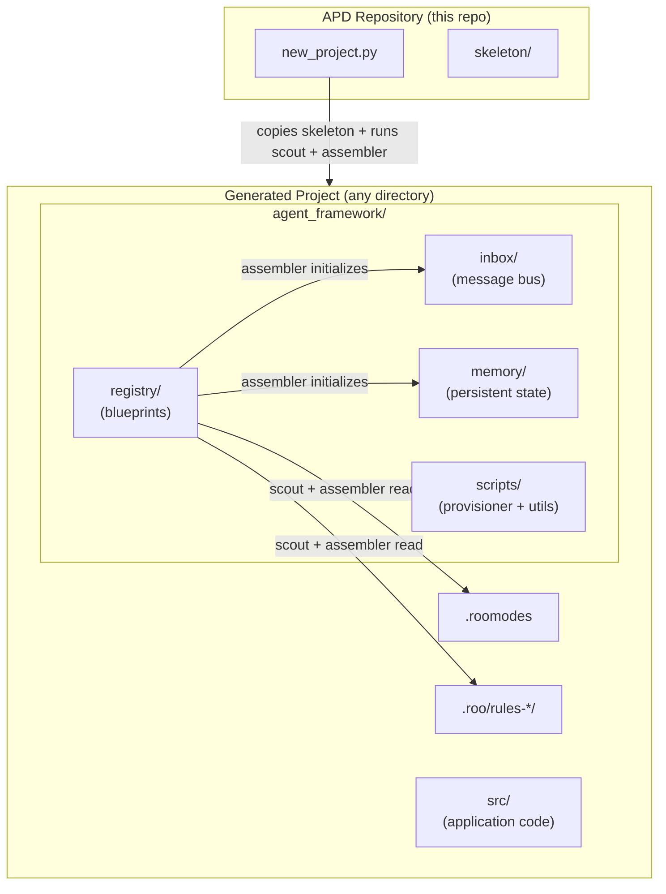
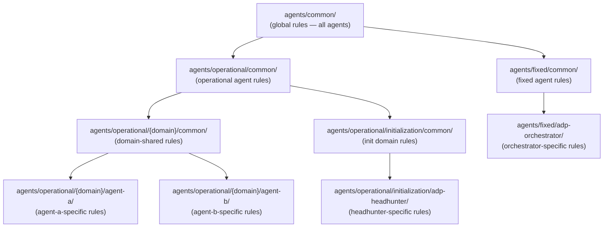

# APD Architecture

## What is APD?

**APD (Autonomous Project Development)** is a multi-agent AI orchestration framework that automates software development cycles. It uses [Roo](https://github.com/RooVetGit/Roo-Code) (a VS Code extension) as the agent runtime and the **filesystem as an asynchronous communication bus**, enabling a team of specialized AI agents to collaborate on a project without human intervention.

The core problem APD solves: AI coding assistants are powerful but require constant human direction. APD removes that bottleneck by defining a structured pipeline where agents hand off work to each other autonomously, only surfacing to the human when a decision or review is genuinely needed.

---

## High-Level Architecture



---

## Two Layers

### Layer 1 — Initializer (`new_project.py`)

The root [`new_project.py`](../../new_project.py) is the **entry point** for creating a new APD-managed project. It:

1. Asks for a destination folder and project name (or a Git repository URL for remote projects).
2. Copies the entire [`skeleton/`](../../skeleton/) directory into the new project root.
3. Generates `agent_framework/config.json` with project metadata.
4. Immediately runs the provisioner scripts ([`scout`](../../skeleton/agent_framework/scripts/provisioner/scout/main.py) → [`assembler`](../../skeleton/agent_framework/scripts/provisioner/assembler/main.py)) to bootstrap the runtime environment.

After this step, the generated project is fully self-contained and ready to be opened in VS Code with Roo.

### Layer 2 — Skeleton (`skeleton/`)

The [`skeleton/`](../../skeleton/) directory is the **template** for every APD project. It contains:

| Path | Purpose |
|---|---|
| `agent_framework/registry/` | Agent blueprints, team definitions, internal templates |
| `agent_framework/scripts/` | Provisioner and utility Python scripts |
| `agent_framework/inbox/` | Filesystem message bus (created/reset by assembler) |
| `agent_framework/memory/` | Persistent technical state shared across agents |
| `agent_framework/templates/` | User-facing document templates (e.g., project briefing template) |
| `src/` | Application source code |

---

## Runtime Environment

The assembler generates the following runtime artifacts in the project root:

### `.roomodes`
A JSON file consumed by the Roo VS Code extension. It defines all **custom agent modes** for the project — one entry per agent in the chosen team. Each mode entry contains the agent's slug, name, role definition, and a pointer to its rules directory.

### `.roo/rules-{slug}/`
Per-agent rule directories. Each directory contains the **flattened, slot-filled Markdown rule files** that Roo injects as system context for that agent. The assembler builds these by traversing the hierarchical rules inheritance chain (see below).

### `agent_framework/inbox/`
The **asynchronous message bus**. A single global inbox replaces the old per-agent folder structure. Agents write outgoing messages to `draft/`, and `post_work` validates and promotes them through the pipeline.

```
agent_framework/inbox/
├── draft/     ← agent writes the next message here (message.md + any attachments)
├── unread/    ← current message being processed (promoted from draft/ by post_work)
└── read/      ← archive of all processed messages (timestamped subfolders)
```

Each entry in `read/` is a folder named `{YYYYMMDD_HHMMSS}_{from}_{to}/` containing the archived `message.md` and any attachments.

### `agent_framework/memory/`
Persistent files shared across all agents:

| File | Purpose |
|---|---|
| `tech_stack.md` | Canonical record of the project's technology choices |
| `decisions.md` | Log of significant architectural and design decisions |

---

## Filesystem as Async Communication Bus

APD uses the filesystem — not API calls, shared memory, or message queues — as its inter-agent communication layer. This design choice provides:

- **Persistence**: messages survive process restarts and VS Code reloads.
- **Auditability**: the full message history is preserved in `read/` folders.
- **Simplicity**: no external infrastructure required; any file system works.
- **Decoupling**: agents never call each other directly; the Orchestrator mediates all routing.

The flow is:
1. An agent writes `message.md` (and any attachments) to `agent_framework/inbox/draft/`. The metadata front-matter must include `from`, `to`, and `subject`.
2. The agent runs `post_work/main.py`, which validates the draft, archives the current `unread/` contents into a timestamped folder inside `read/`, and promotes `draft/` contents to `unread/`.
3. The agent outputs `Done` — signaling the Orchestrator to re-scan the queue.
4. The Orchestrator runs `scan_inbox/main.py`, which reads the `to` field from `unread/message.md` and returns the recipient's slug.
5. The Orchestrator invokes the recipient agent via Roo's `new_task` tool.

---

## Hierarchical Rules System

Agent behavior is defined by layered Markdown rule files. The assembler traverses the registry hierarchy and **flattens all applicable rules** into each agent's `.roo/rules-{slug}/` directory.

The framework is fully customizable — you can add new operational agents under any domain group. The diagram below shows the built-in structure; custom agents follow the same pattern.



Each level adds more specific constraints. An agent's effective ruleset is the union of all rules from the root of the hierarchy down to its specific folder, plus the team's `workflow.md`. This means:

- Global rules (autonomy, file integrity) apply to **every** agent.
- Operational rules (Done protocol, post-work, handoff) apply to all **non-orchestrator** agents.
- Domain rules apply only to agents within that domain group.
- Agent-specific instructions define the precise execution pipeline for each role.