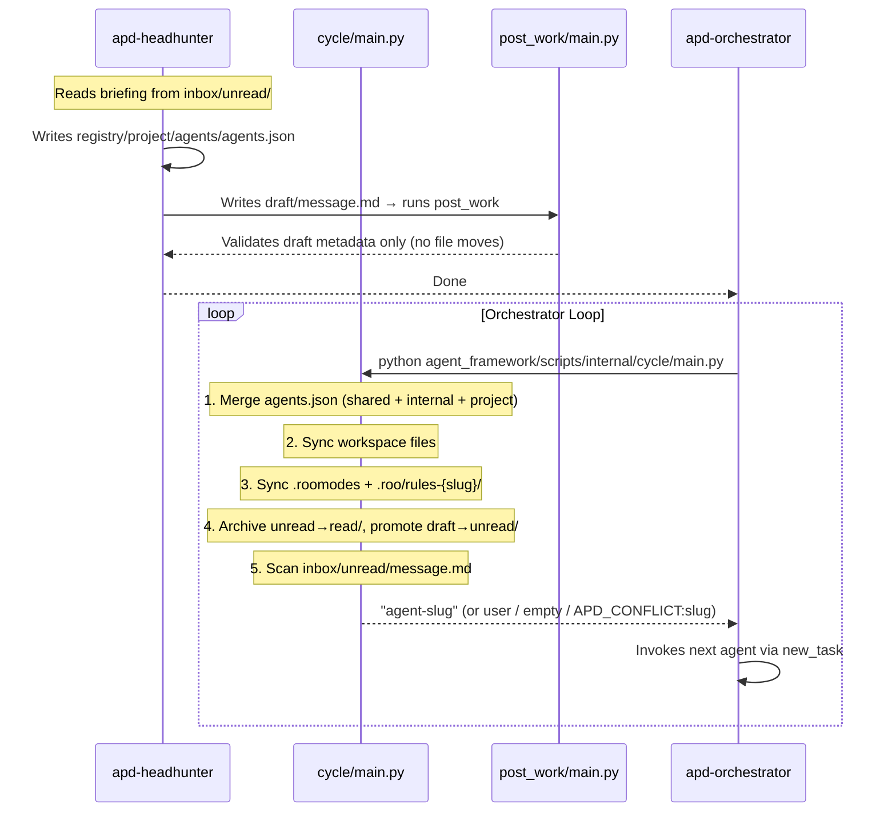

# APD Scripts

## Overview

APD scripts are Python utilities that power the framework's automation. They fall into two groups:

| Group | Scripts | Purpose |
|---|---|---|
| **Root Entry Point** | `scripts/new_project/main.py` | Creates a new APD-managed project |
| **Root Entry Point** | `scripts/git_flow/main.py` | Commits, merges, and resets the git flow for a stable release |
| **Runtime Scripts** | `cycle/main.py`, `post_work/main.py` | Support the autonomous agent loop |

Runtime scripts live inside a generated project under `agent_framework/scripts/` and are run from the **project root** (not from the script's own directory). They are synced from the registry workspace on every cycle.

---

## Root Entry Point

### `scripts/new_project/main.py`

**Location:** [`scripts/new_project/main.py`](../scripts/new_project/main.py)

**Purpose:** Interactive CLI wizard that creates a new APD-managed project by copying the skeleton and bootstrapping the runtime environment.

**Configuration:** [`scripts/new_project/input.json`](../scripts/new_project/input.json)

Before running the wizard, you can set a default destination folder in `input.json` so you don't have to type it every time:

```json
{
  "default_destination": "/path/to/your/projects"
}
```

When `default_destination` is set, the prompt will show it as the default value and accept it with a simple Enter keypress. Leave the field as an empty string `""` to always be prompted.

**Inputs (interactive prompts):**
1. Destination folder (full path) — pre-filled from `input.json` if `default_destination` is set
2. Project type: `[1] Local` or `[2] Remote`
3. If local: project name
4. If remote: Git repository SSH URL (project name is derived automatically)

**Outputs:**
- A new project directory at `{destination}/{project_name}/`
- `agent_framework/config.json` with project metadata
- All skeleton files copied into the project root
- A fully bootstrapped runtime environment (`.roomodes`, `.roo/rules-*/`, `agent_framework/inbox/`, `agent_framework/memory/`)

**Steps executed:**
1. `[1/3]` Create local directory or clone remote Git repository.
2. `[2/3]` Copy the `skeleton/` directory into the project root (`shutil.copytree`).
3. `[3/3]` Generate `agent_framework/config.json`.
4. `[4/4]` Run `cycle/main.py` to generate initial agent files.
5. `[5/5]` Open the generated project in VS Code (`code {project_path}`).

**Side effects:** None on the APD repository itself. All changes are made in the destination directory.

**When called:** Manually by the developer, once per project.

---

## Root Entry Point

### `scripts/git_flow/main.py`

**Location:** [`scripts/git_flow/main.py`](../scripts/git_flow/main.py)

**Purpose:** Automates the full git release flow — commits and pushes the current branch, merges it into `main`, cleans up the branch locally and remotely, creates a fresh `improvements` branch, and resets `input.json` to empty strings.

**Configuration:** [`scripts/git_flow/input.json`](../scripts/git_flow/input.json)

Fill in all three fields before running:

```json
{
  "current_branch": "improvements",
  "commit_message": "your commit message here",
  "merge_message": "your merge message here"
}
```

**Inputs:** Read from `scripts/git_flow/input.json` — no interactive prompts.

| Field | Description |
|---|---|
| `current_branch` | The branch to commit, push, and merge into `main` |
| `commit_message` | Message for the commit on the current branch |
| `merge_message` | Message for the `--no-ff` merge commit into `main` |

**Steps executed:**
1. `git add . && git commit -m "{commit_message}" && git push --set-upstream origin {current_branch}`
2. `git checkout main && git merge {current_branch} --no-ff -m "{merge_message}" && git push origin main && git branch -d {current_branch} && git push origin --delete {current_branch}`
3. `git checkout -b improvements` — recreates the improvements branch for the next cycle; resets all `input.json` fields to empty strings.

**Side effects:**
- Pushes commits to the remote repository.
- Deletes `{current_branch}` both locally and on the remote.
- Creates a new local `improvements` branch.
- Resets `scripts/git_flow/input.json` fields to `""`.

**When called:** Manually by the developer when a branch is ready to be merged into `main`.

---

## Runtime Scripts

### `cycle/main.py`

**Location (registry source):** [`skeleton/agent_framework/registry/internal/workspace/scripts/internal/cycle/main.py`](../skeleton/agent_framework/registry/internal/workspace/scripts/internal/cycle/main.py)

**Location (in generated project):** `agent_framework/scripts/internal/cycle/main.py`

**Purpose:** The core runtime script. Runs every time the Orchestrator starts its loop. Performs five steps in order:
1. **Merge agents** — loads `registry/shared/agents/agents.json`, `registry/internal/agents/agents.json`, and `registry/project/agents/agents.json`, checks for slug conflicts between internal and project agents, and produces a merged agent roster.
2. **Sync workspace** — copies files from `registry/internal/workspace/` and `registry/project/workspace/` into `agent_framework/`, keeping the newer version of any file that already exists.
3. **Sync Roo environment** — rebuilds `.roomodes` and `.roo/rules-{slug}/` from the merged agent definitions. Only updates entries that have changed (compares mtimes and mode entries).
4. **Promote messages** — if `inbox/draft/` has content: archives the current `inbox/unread/` contents into a timestamped folder inside `inbox/read/` (skipped if `unread/` contains only a `.gitkeep`), then moves all files from `draft/` into `unread/`.
5. **Scan inbox** — reads `agent_framework/inbox/unread/message.md` and returns the `to` field value.

**Input:** None — reads the filesystem directly.

**Output (stdout, last line):**

| Output | Meaning |
|---|---|
| `APD_CONFLICT:{slug}` | Duplicate slug detected between `internal` and `project` `agents.json` |
| `user` | `agent_framework/inbox/unread/message.md` exists and its `to` field is `user` |
| `{agent-slug}` | `agent_framework/inbox/unread/message.md` exists and its `to` field is `{agent-slug}` |
| `empty` | `agent_framework/inbox/unread/message.md` does not exist or has no `to` field |

**Side effects:**
- Updates `.roomodes` if the agent roster has changed.
- Rebuilds `.roo/rules-{slug}/` for any agent whose rules or mode entry have changed.
- Syncs new or updated workspace files into `agent_framework/`.
- Archives `inbox/unread/` and promotes `inbox/draft/` → `inbox/unread/` when a draft message is present.

**When called:**
- By `scripts/new_project/main.py` during initial project creation.
- By `apd-orchestrator` at the start of every loop iteration.

---

### `post_work/main.py`

**Location (registry source):** [`skeleton/agent_framework/registry/shared/workspace/scripts/shared/post_work/main.py`](../skeleton/agent_framework/registry/shared/workspace/scripts/shared/post_work/main.py)

**Location (in generated project):** `agent_framework/scripts/shared/post_work/main.py`

**Purpose:** Validates the outgoing draft message. Every operational agent must run this before outputting `Done`. The actual message promotion (archiving `unread/` and moving `draft/` → `unread/`) is handled automatically by `cycle/main.py` at the start of the next loop iteration.

**Input:** `agent_framework/inbox/draft/message.md` — written by the agent before calling this script. No `input.json` is required.

**Required metadata in `draft/message.md`:**
```
<message_metadata>
from: {sender-slug}
to: {recipient-slug}
subject: {brief description}
</message_metadata>
```

**Steps:**
1. Read and parse the `<message_metadata>` block from `agent_framework/inbox/draft/message.md`.
2. Validate that `from`, `to`, and `subject` are all present and non-empty.
   - If invalid: print a descriptive error to stdout and **exit without moving anything**. The agent must correct the draft and re-run.

**Side effects:**
- On success: prints a confirmation and exits. The draft remains in `draft/` until `cycle/main.py` promotes it.
- On validation failure: nothing is moved; the agent must fix the draft and re-run.

**When called:** By every operational agent as the **last action** before outputting `Done`.

---

## Script Relationships


