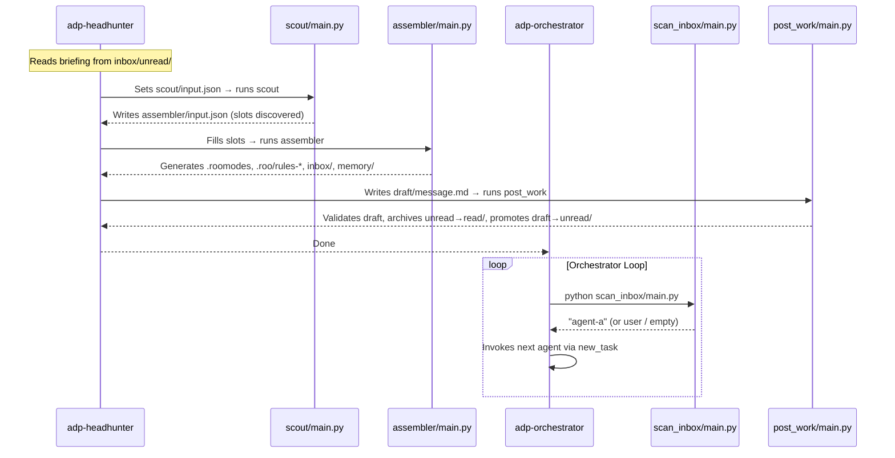

# APD Scripts

## Overview

APD scripts are Python utilities that power the framework's automation. They fall into three groups:

| Group | Scripts | Purpose |
|---|---|---|
| **Root Entry Point** | `scripts/new_project/main.py` | Creates a new APD-managed project |
| **Provisioner** | `scout/main.py`, `assembler/main.py` | Builds the runtime environment from registry blueprints |
| **Utilities** | `scan_inbox/main.py`, `post_work/main.py` | Support the autonomous agent loop |

All scripts inside a generated project live under `agent_framework/scripts/` and are run from the **project root** (not from the script's own directory).

---

## Root Entry Point

### `scripts/new_project/main.py`

**Location:** [`scripts/new_project/main.py`](../scripts/new_project/main.py)

**Purpose:** Interactive CLI wizard that creates a new APD-managed project by copying the skeleton and bootstrapping the runtime environment.

**Configuration:** [`scripts/new_project/config.json`](../scripts/new_project/config.json)

Before running the wizard, you can set a default destination folder in `config.json` so you don't have to type it every time:

```json
{
  "default_destination": "/path/to/your/projects"
}
```

When `default_destination` is set, the prompt will show it as the default value and accept it with a simple Enter keypress. Leave the field as an empty string `""` to always be prompted.

**Inputs (interactive prompts):**
1. Destination folder (full path) — pre-filled from `config.json` if `default_destination` is set
2. Project type: `[1] Local` or `[2] Remote`
3. If local: project name
4. If remote: Git repository SSH URL (project name is derived automatically)

**Outputs:**
- A new project directory at `{destination}/{project_name}/`
- `agent_framework/config.json` with project metadata
- All skeleton files copied into the project root
- A fully provisioned runtime environment (`.roomodes`, `.roo/rules-*/`, `agent_framework/inbox/`, `agent_framework/memory/`)

**Steps executed:**
1. `[1/4]` Create local directory or clone remote Git repository.
2. `[2/4]` Copy the `skeleton/` directory into the project root (`shutil.copytree`).
3. `[3/4]` Generate `.apd/config.json`.
4. `[4/4]` Run `scout/main.py` → `assembler/main.py` (provisioner pipeline).

**Side effects:** None on the APD repository itself. All changes are made in the destination directory.

**When called:** Manually by the developer, once per project.

---

## Provisioner Scripts

The provisioner is a two-stage pipeline: **Scout** discovers what needs to be filled in, and **Assembler** builds the complete runtime environment.

### `scout/main.py`

**Location:** [`agent_framework/scripts/provisioner/scout/main.py`](../../skeleton/agent_framework/scripts/provisioner/scout/main.py)

**Purpose:** Scans all registry files for the chosen team and discovers every `{{placeholder}}` that needs to be filled before the environment can be assembled.

**Input:** `agent_framework/scripts/provisioner/scout/input.json`
```json
{
  "chosen_team": "team-a"
}
```

**Output:** Writes `agent_framework/scripts/provisioner/assembler/input.json` with the discovered slots:
```json
{
  "chosen_team": "team-a",
  "slots": {
    "goal": "{{goal}}",
    "criteria_1": "{{criteria_1}}",
    "tech_stack": "{{tech_stack}}"
  }
}
```

**What it scans:**
- The team's `workflow.md`
- All `.md` and `.json` files in each agent's full inheritance path (global common → type common → domain common → agent-specific folder)

**Side effects:**
- **Auto-resets** `scout/input.json` to `{"chosen_team": ""}` after completion, preventing stale state from leaking into subsequent runs.

**When called:**
- By `new_project.py` during initial project creation (with team `init`).
- By `adp-headhunter` during team provisioning (with the chosen team).

---

### `assembler/main.py`

**Location:** [`agent_framework/scripts/provisioner/assembler/main.py`](../../skeleton/agent_framework/scripts/provisioner/assembler/main.py)

**Purpose:** Performs a **full wipe and rebuild** of the runtime environment. Reads the slot-filled `input.json` produced by Scout, substitutes all `{{placeholders}}` in registry files, and generates the complete Roo configuration.

**Input:** `agent_framework/scripts/provisioner/assembler/input.json`
```json
{
  "chosen_team": "team-a",
  "slots": {
    "goal": "Build a REST API for task management",
    "criteria_1": "All endpoints return JSON"
  }
}
```

**Outputs (all generated in the project root):**

| Output | Description |
|---|---|
| `.roomodes` | JSON file defining all custom Roo agent modes for the team |
| `.roo/rules/` | Global rules (from `agents/common/`) applied to all agents via Roo's global rules mechanism |
| `.roo/rules-{slug}/` | Per-agent flattened rule files (one directory per agent) |
| `agent_framework/inbox/` | Recreated global inbox with `draft/`, `unread/`, and `read/` subfolders |
| `agent_framework/memory/tech_stack.md` | Initialized from template with slots filled |
| `agent_framework/memory/decisions.md` | Initialized from template with slots filled |
| `agent_framework/inbox/internal_templates/` | Message templates copied for agent use |

**Wipe phase:** Before building, the assembler performs the following cleanup:
- **Deletes** `.roo/`
- **Deletes** `.roomodes`
- **Archives** `agent_framework/inbox/apd-headhunter/` → moved to `agent_framework/archive/apd-headhunter/` (preserves the headhunter's read history across re-provisioning)
- **Deletes** `agent_framework/inbox/` (remainder)
- **Deletes** `agent_framework/memory/`
- **Recreates** `agent_framework/inbox/` with the global structure: `draft/`, `unread/`, `read/`

This ensures a clean state with no leftover artifacts from previous provisioning runs.

**Rules assembly per agent:**
1. Copy global common rules (`.roo/rules/`).
2. Traverse the agent's path hierarchy, copying each `common/` folder's `.md` files into `.roo/rules-{slug}/`.
3. Copy the agent's own specific `.md` files into `.roo/rules-{slug}/`.
4. Copy the team's `workflow.md` into `.roo/rules-{slug}/` — **skipped for `apd-orchestrator`**, which has no inbox and does not participate in the routing table.
5. Read `mode.json`, inject `slug` and `customInstructions` path, append to `.roomodes`.

> **Note on `apd-orchestrator`:** This agent is treated specially by the assembler. It does **not** get an inbox folder and does **not** receive the team's `workflow.md`. It operates outside the message-passing loop — it is triggered directly by the human and routes work by reading the `to` field from `agent_framework/inbox/unread/message.md` via `scan_inbox`.

**Side effects:**
- **Auto-resets** `assembler/input.json` to `{"chosen_team": "", "slots": {}}` after completion.

**When called:**
- By `new_project.py` (immediately after Scout, during project creation).
- By `adp-headhunter` (after Scout, during team provisioning).

---

## Utility Scripts

### `scan_inbox/main.py`

**Location:** [`agent_framework/scripts/utils/scan_inbox/main.py`](../../skeleton/agent_framework/scripts/utils/scan_inbox/main.py)

**Purpose:** Checks the global message queue and returns the slug of the next agent to be invoked (or a special status string).

**Input:** None — reads the filesystem directly.

**Output (stdout, one of three values):**

| Output | Meaning |
|---|---|
| `user` | `agent_framework/inbox/unread/message.md` exists and its `to` field is `user` |
| `{agent-slug}` | `agent_framework/inbox/unread/message.md` exists and its `to` field is `{agent-slug}` |
| `empty` | `agent_framework/inbox/unread/message.md` does not exist or has no `to` field |

**Priority logic:**
1. If `to` is `user` — return `user` first (human intervention always takes priority).
2. Otherwise return the value of the `to` field verbatim.
3. If `unread/message.md` is absent or unreadable, return `empty`.

**Side effects:** None — read-only operation.

**When called:** By `adp-orchestrator` at the start of every loop iteration.

---

### `post_work/main.py`

**Location:** [`agent_framework/scripts/utils/post_work/main.py`](../../skeleton/agent_framework/scripts/utils/post_work/main.py)

**Purpose:** Validates the outgoing draft message, archives the current `unread/` contents, and promotes the `draft/` contents to `unread/`. Every operational agent must run this before outputting `Done`.

**Input:** `agent_framework/inbox/draft/message.md` — written by the agent before calling this script. No `input.json` is required.

**Required metadata in `draft/message.md`:**
```
<message_metadata>
from: {sender-slug}
to: {recipient-slug}
subject: {brief description}
</message_metadata>
```

**Steps:**
1. Read and parse the front-matter metadata from `agent_framework/inbox/draft/message.md`.
2. Validate that `from`, `to`, and `subject` are all present and non-empty.
   - If invalid: print a descriptive error to stdout and **exit without moving anything**. The agent must correct the draft and re-run.
3. Archive the current contents of `unread/` into a new timestamped folder inside `read/`. Folder name pattern: `{YYYYMMDD_HHMMSS}_{from}_{to}/`.
4. Move all files from `draft/` into `unread/`.

**Side effects:**
- On success: `unread/` is replaced with the new message; previous `unread/` contents are preserved in `read/`.
- On validation failure: nothing is moved; the agent must fix the draft and re-run.

**When called:** By every operational agent as the **last action** before outputting `Done`.

---

## Script Relationships


